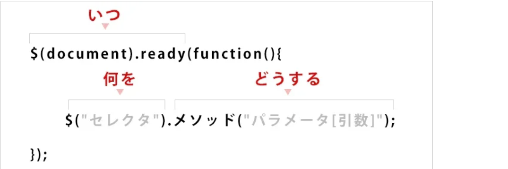

# jqueryに関するmyとらのまき

- [jqueryに関するmyとらのまき](#jqueryに関するmyとらのまき)
  - [ready()](#ready)
    - [記述方法 - その１](#記述方法---その１)
    - [記述方法 - その２：省略表記](#記述方法---その２省略表記)
  - [セレクタ](#セレクタ)
    - [例）id="text"の文字色を赤にする](#例idtextの文字色を赤にする)
  - [メソッド](#メソッド)
  - [イベントハンドラ](#イベントハンドラ)
    - [ボタンをクリックしたら textの色を変える](#ボタンをクリックしたら-textの色を変える)
  - [テキストを書き換える](#テキストを書き換える)
    - [JavaScript の場合](#javascript-の場合)
    - [jQuery の場合](#jquery-の場合)
  - [jQuery の読み込み方](#jquery-の読み込み方)
    - [自分のサーバに設置する場合](#自分のサーバに設置する場合)
    - [GoogleサーバーのCDNを読み込む場合](#googleサーバーのcdnを読み込む場合)
  - [図-1](#図-1)
  - [CSS - 非表示](#css---非表示)
  - [関数の書き方](#関数の書き方)
    - [関数を使用しない場合](#関数を使用しない場合)
    - [関数を使用する場合](#関数を使用する場合)
  - [::before,::after、content](#beforeaftercontent)
    - [例１）リストの最後にフロートの解除を行う](#例１リストの最後にフロートの解除を行う)
  - [data](#data)
    - [\[ \]で囲み値を含めて指定することでセレクタとして使用可能](#-で囲み値を含めて指定することでセレクタとして使用可能)
    - [data()とattr()の違い](#dataとattrの違い)


## ready()
| - | -  |
| :-- | :-- |
| 概要 | DOMツリーが構築されたら実行される |
| loadとの違い | loadはDOMが読み込まれた後、画像が読み込まれてからイベントが発生するので遅い |

### 記述方法 - その１
``` 
$(document).ready(function(){
   alert("完了");
}); 
```

### 記述方法 - その２：省略表記
```
$(function(){
   alert("完了");
 });
```

## セレクタ
| セレクタ名 | 表記 | 説明 |
| :-- | :-- | :-- |
| 要素   | $("p")       | p要素全て |
| ID    | $("#hoge")   | id="hoge" |
| クラス | $(".hoge")  | class="hoge" |
| 子孫   | $("p a")     | p要素の中のa要素 |
| nth-child疑似クラス | $("li:nth-child(3)") | ３番目のli 要素 |
| cssの属性 | $("[id]") | id属性を持つ要素 |
| jQuery独自のevenフィルタ | $("li:even") | 偶数番目のli要素 |

### 例）id="text"の文字色を赤にする
```
$(function() {
    $(#text).css("color", "red");
});
```

## メソッド
| - | - |
| :-- | :-- |
| hide()        | 要素を非表示にする |
| show()        | 要素を表示する     |
| addClass()    | クラスを追加する  |
| removeClass() | クラスを削除する   |
| remove()      | 要素を削除する     |
| text()        | 要素内のテキストを取得・書き換えする |
| attr()        | 要素に任意の属性を付与 |
| fadeIn()      | 非表示要素を、徐々に表示する |
| fadeOut()     | 要素を徐々に非表示にする |
| html()        | ■パラメータなし<br>　⇒要素の値を取得<br>■パラメータあり<br>　⇒要素の値を書き換える |
| css()         | cssスタイルの取得   |

## イベントハンドラ
何かイベントが発生した時に処理を実行する

### ボタンをクリックしたら textの色を変える
```
$("#button").on("click", function() {
    $("text").css("color", "red");
});
```

## テキストを書き換える
### JavaScript の場合
```
var hoge = document.getElementById('hoge');
hoge.innerHTML = 'あいうえお';
```
### jQuery の場合
```
$('#hoge').html('あいうえお');
```

## jQuery の読み込み方
※自作のjQueryファイルよりも前に読み込んでおく
### 自分のサーバに設置する場合
```
<script src="js/jquery-3.2.1.min.js"></script>
```
### GoogleサーバーのCDNを読み込む場合
```
<script src="https://ajax.googleapis.com/ajax/libs/jquery/3.2.1/jquery.min.js"></script>
```
## 図-1
;

## CSS - 非表示
| - | - |
| :-- | :-- |
| display: none; | 表示形式をかえて隠す。<br>要素ごと無くなる |
| visibility: hidden; | 表示・非表示を指定して隠す。要素は残る |
| opacity: 0; | 透明度を変えて隠す。要素は残る |

## 関数の書き方
### 関数を使用しない場合
```
$(function() {
    $("header").on("mouseover", function() {
        // 処理１
    });
});
```
### 関数を使用する場合
```
$(function() {
    $("header").on("mouseover", 関数名);

    function 関数名() {
        // 処理１
    }
});
```

## ::before,::after、content
・beforeは前、afterは後ろにスタイルを適用させる
・conent は:before または :after という擬似要素を使ってテキストや画像などのコンテンツを挿入する際に使用する。擬似要素とは、HTMLなどの文書には記述されていない要素をCSSによって新たに作り出された架空の要素です。
### 例１）リストの最後にフロートの解除を行う
```
clearfix::after{}
```
■ HTML
```
<ul class="memo">
    <li>1これは、注意書き１番目</li>
    <li>2これは、注意書き２番目</li>
</ul>
```
■ CSS
```
ul {
    width: 960px;
    margin: 0 auto;
}
ul li {
    float: left;
    width: 240px;
}
.clearfix::after {
    contenet: "";
    clear: both;
    overflow: hidden;
}
```

## data
data-〇〇="値"
* 〇〇は大文字は不可
* 〇〇は「半角英数字」「-」「_」「.」
* 値にあたる部分は取得時に「文字列」として扱う。数値とする場合はキャストが必用

```
<html>
<head>
<script src="https://code.jquery.com/jquery-3.5.1.min.js"></script>
<script>
	$(function(){
	    $('li').click(function(){
	        var text = $(this).text() + 'は' + $(this).data('age') + '歳の' + $(this).data('gender');
	        $('.result').text(text);
	    });
	});
</script>
</head>
<body>
<p>リストをクリックしてください</p>
<ul>
    <li data-age="10" data-gender="男の子">のび太</li>
    <li data-age="10" data-gender="女の子">しずか</li>
</ul>
<p class="result">ここに結果を表示します</p>
</body>

```

### [ ]で囲み値を含めて指定することでセレクタとして使用可能
```
<ul>
  <li data-name="test1">テスト１</li>
  <li data-name="test2">テスト２</li>
  <li data-name="test3">テスト３</li>
</ul>

<script>
$(function(){
  console.log( $('data-name="test1"]').text());
}
</script>
```

### data()とattr()の違い
* data()で取得・書き換えを行うのはDOMオブジェクト
* attr()で取得・書き換えを行うのはHTMLの属性

⇒ data()でdata-〇〇属性を書き換えた後、[data-〇〇]でcssを設定している場合もcssは反映されない
⇒ attr()で値を変更した後data()で取得しても書き換えた後の値にならない